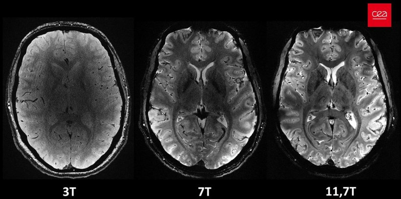
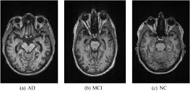

🧠 MRI Brain Tumor Image Generation using GANs

    

📌 Overview

Medical imaging datasets often suffer from class imbalance, where tumor-positive MRI scans are significantly fewer than normal scans.
This imbalance reduces the performance and generalization ability of deep learning models.

This project uses Generative Adversarial Networks (GANs) to generate realistic synthetic brain tumor MRI images for dataset augmentation.

The generated images improve data diversity and enhance downstream model robustness.

🖼️ Sample Results
Original MRI Scan

  

GAN Generated MRI Image

  

🏗️ Methodology

The system follows an adversarial learning process:

Random Noise (z)
        ↓
Generator
        ↓
Synthetic MRI Image
        ↓
Discriminator (Real vs Fake)
        ↓
Backpropagation & Optimization

🧠 Key Features

• GAN-based MRI tumor image synthesis
• Reduces dataset imbalance
• Improves model generalization
• Modular training pipeline
• Scalable architecture

🛠️ Tech Stack

Programming Language
Python

Deep Learning Framework
PyTorch / TensorFlow

Libraries
NumPy
OpenCV
Matplotlib
📂 Project Structure
MRI-GAN/
│
├── dataset/              # MRI training dataset
├── models/               # Generator & Discriminator architectures
├── train.py              # Model training script
├── generate.py           # Image generation script
├── outputs/              # Generated images
├── requirements.txt      # Dependencies
└── README.md             # Documentation
🎯 Objectives

• Address class imbalance in medical datasets
• Improve AI model robustness
• Demonstrate applied generative deep learning in healthcare

📌 Conclusion

This project demonstrates how GANs can be effectively applied in medical imaging to generate realistic synthetic MRI tumor images.

By improving dataset diversity, the system enhances the performance and stability of AI-based diagnostic models.
